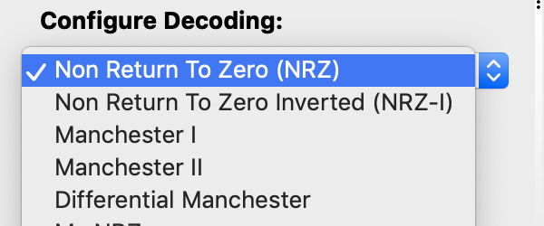

# aws-iot-dog-collar

## Purpose

Create an AWS-powered IoT dog collar that is triggered to give  safe vibration when the host dog is detected by an AWS DeepLens camera getting into trash or getting on sofa when the owner is not home. 

## Overview

An AWS DeepLens is used to build and train a model that detects when a dog is getting into the trash or getting on a sofa. These, or other trained triggers, are herein referred to as "bad behavior". 

When the AWS DeepLens detects bad behavior it instructs a nearby Raspberry Pi ("pi") to send a signal to the dog's collar that triggers a vibration. 

## Status

### Complete

* Decode RF signals from dog collar remote
* transmit decoded signals with Pi and confirm collar responds as expected

### Next Steps

* Build AWS Lambda + Greengrass solution on pi to transit signals to collar when triggered via MQTT topic on AWS IoT Core
* Build and train ML model with AWS SageMaker to detect dog on couch
* Deploy model to AWS DeepLens
* Configure DeepLens to send vibrate message to pi transmitter when it detects dog on couch

## Materials

Links provided are to the specific products I used. Generally speaking, any similar products should work; just be sure to match the RF frequency of the collar (e.g. 433 Mhz) with the frequency of the RF transmitter.

1. [RTL-SDR Radio](https://www.amazon.com/gp/product/B01GDN1T4S/ref=ppx_yo_dt_b_asin_title_o01__o00_s01?ie=UTF8&psc=1)

2. [433 Mhz Remote-Controlled Dog Vibration and/or Shock Collar](https://www.amazon.com/gp/product/B00MQ1RBAS/ref=ppx_yo_dt_b_asin_title_o02__o00_s00?ie=UTF8&psc=1)

3. [433 Mhz RF Transmitter](https://www.amazon.com/gp/product/B00HEDRHG6/ref=ppx_yo_dt_b_asin_title_o03__o00_s00?ie=UTF8&psc=1)

4. [Raspberri Pi 3](https://www.amazon.com/gp/product/B01CD5VC92/ref=oh_aui_search_asin_title?ie=UTF8&psc=1)

5. Wires to connect Raspberry Pi to RF transmitter

## RF Wiring

Wiring for both the RF transmitter (left) and RF receiver (right) is below, though the receiver is not needed since we will instead use an RTL-SDR antenna:


### RF Transmitter Wiring

From left-most pin 1 to right-most pin 4:

* Pin 1 "VCC" -> 3.3V on pi
* Pin 2 "DA" -> GPIO 17 on pi
* Pin 3 "G" -> ground on pi
* Pin 4 "AN" -> not used, but I assume this is for an Antenna

### RF Receiver Wiring

This particular RF receiver seemed to have two separate sets of 4 pins each, one on the left and one on the right. In the picture above, you only see the first set of pins as I didn't use/need the second set. 

From left-most pin 1 to right-most pin 4: 

* Pin 1 "GND" -> ground on pi
* Pin 2 "Data" -> GPIO 23 on pi
* Pin 3 "DER" -> unknown; seems to be interchangeable with Pin 2
* Pin 4 "+5V" -> 3.3v on pi

**Note** - even though the receiver's power pin says "+5V", I connected it to a 3.3V pin on the pi because I read that +5V can damage the GPIO pins on the pi. Not sure how accurate this is, but I wanted to be safe. It didn't seem to affect results. 

## Signal Decoding

I used [Ultimate Radio Hacker (URH)](https://github.com/jopohl/urh), a popular and powerful tool for decoding the collar's radio signals. URH requires its own deep dive and there are already docs on line, so I will gloss over many steps.

### Record Signal

First things first, I started URH up, chose **Record Signal**, set the collar remote to Channel 1, Shock Mode, and proceeded to transmit each of the 100 power settings. When done, I saved the capture as a file for subsequent analysis:


Each set of two to three adjacent black bars corresponded with a repeated transmission for each of the different power settings I transmitted on the remote. A single button on the remote sends a repeating burst of the same signal... therefore, the number of adjacent bars varies somewhat depending on the total time I held the button for each press.

To help understand what's going on, it is important to point out that a "single" black bar above is actually a many smaller analog signals that, when zoomed out, appear as one bar. For example, when zoomed in, a single bar above looks like the image below: 


The whole point of the above section is to show that "size is relative". Is the single black bar I'm looking at 5 signals of 100us each (e.g. 11111) or is it one signal of 500us (e.g. 1)? the answer depends on how the device manufacturer chose to encode their signal... but you can likely answer that question from the built-in URH autodetect features or by zooming in on the sample and measuring the narrowest distance between two peaks.

### Interpretating the Signal

The nest step is to move to the **Interpretation** window in URH. Here, you can edit various settings to tell URH how your 1s and 0s are encoded in the signal. Refer to online docs & videos for detail. I found that setting the modulation to ASK and clicking Autodetect was all that was needed. (Note, later analysis is what really gave me confidence that autodetect was correct):


Note that the interpret tab will not directly tell you whether the settings are right or wrong. That being said, the online videos are solid at giving a foundational understanding to help you along. There are also a few tips in the **Analysis** section below that can help you verify things are correct.

## Analyzing the Signal

On the analysis tab you will see a grid containing 1s and 0s. 


Each row represents URH's detection of a separate signal and each column represents a bit (1 or 0) within a given signal.

The **Interpretation Settings** you chose on the previous screen (e.g. modulation type, bit length, etc.) are one of two key things that will determine the contents of the grid.

The other key setting that determines the grid content is the **Configure Decoding**:



In simple terms, your decoding method (if any) translates raw patterns of  1s and 0s from your captured signal into 1s and 0s that represent your intended message.

I do not know enough about RF to be able to explain different encoding types and the reasons for their use. If you are curious, here are some starter articles:

* [Non-return-to-zero Encoding](https://en.wikipedia.org/wiki/Non-return-to-zero)
* [Manchester Data Encoding for Radio Communications](https://www.maximintegrated.com/en/app-notes/index.mvp/id/3435)

Anyway, a key thing I noticed is that URH will tell you the error percentage, if any, that your selected decoding method has when applied to one or more signals you highlight in the analysis grid.

For example, the image below shows a 0% error rate for the selected rows with NRZ decoding:


When I switch the encoding to Manchester I, notice that the error rate jumps up to ~54%: 


If you have the right settings, your error rate should be very low. With me, my error rate was always 0%, but I say "very low" simply because I haven't tested other devices and I imagine its possible some devices/messages/encoding might be subject to occasional error or random interference.

### Signal Deep Dive

I'll save you some reading and say that if I re-transmit the NRZ-decoded signals with my Pi, they work and activate the collar.

This section talks about further analysis of the signal. Specifically, figuring out what each section of those 213-character bit strings means so that I can programmatically generate codes rather than have to record every possible button press and embed within a script. Now, if I had a simple device that only had a few possible combinations, that wouldn't be a problem... but since this remote has 2 channels, 4 modes, and 0 to 100 power settings (for two modes), it has approximately ~400 different code combinations.

First things first, I looked at the raw 213-character codes for Channel 1, Shock Mode, for each power setting 0 to 100.

I noticed that most of the codes stayed the same except for one large section towards the end that seemed to change systematically with each key press.

**Pro Tip!** Enable the **Mark diffs in protocol** checkbox (left side) to highlight any bits that change from the previous signal in red. This makes it much easier to see differences, as shown below: 


**The red differences above caused a pattern to jump out!** I noticed that, except for the first 8 bits of every signal, the remaining 205 bits were all patterns of 00001 or 11101!

I suspected that each "000" represented a 0, each "111" represented a "1", and a "separator" of "01" between each 000 or 111 code.

 What exactly did this mean? I wasn't sure, but I used this info to apply an encoding that (a) ignored the first 8 bits, (b) removed the "01" separator signal, and (c) compressed 000 to 0 and 111 to 1.

Skipping the first 8 bits, which I noticed were always '11111111' and seemed to be the only section that didn't conform to the '11101' or '00001' pattern:


Remove the '01' that seems to separate all of the remaining 000 and 111 patterns:


Replace '000' with '0' and '111' with '1':


To recap all of the above, let's start with an original 213 signal for Channel 1, shock mode, power 0, using a bit length of 200 and ASK modulation mode with an NRZ decoding:

```sh
111111110000111101000010000100001000010000100001111011110100001000010000100001000010000100001111011110111101000010000111101111010000100001000010000100001000010000100001000010000111101111011110111101111011110100001
```

Below is the same code as above with a space added after the first 8 bits and after every 5th subsequent bit, just to make my earlier observations easier to see:

```sh
11111111 00001 11101 00001 00001 00001 00001 00001 00001 11101 11101 00001 00001 00001 00001 00001 00001 00001 11101 11101 11101 00001 00001 11101 11101 00001 00001 00001 00001 00001 00001 00001 00001 00001 00001 11101 11101 11101 11101 11101 11101 00001
```

Per above, we can see that apart from the first 8 bits, the remaining bits are either sequences of "00001" or "11101".

Referring back to our decode steps earlier, we are left with the following if we ignore the first 8 bits: 

```sh
00001 11101 00001 00001 00001 00001 00001 00001 11101 11101 00001 00001 00001 00001 00001 00001 00001 11101 11101 11101 00001 00001 11101 11101 00001 00001 00001 00001 00001 00001 00001 00001 00001 00001 11101 11101 11101 11101 11101 11101 00001
```

The "01" trailing each of the remaining 5 bit sequences seems to be some sort of meaningless separator, so we strip it using the **Remove Carrier** decoding function: 

```sh
000 111 000 000 000 000 000 000 111 111 000 000 000 000 000 000 000 111 111 111 000 000 111 111 000 000 000 000 000 000 000 000 000 000 111 111 111 111 111 111 000
```

And now we use the **Remove Redundancy** decoding function to replace 000 with 0 and 111 with 1: 

```sh
0 1 0 0 0 0 0 0 1 1 0 0 0 0 0 0 0 1 1 1 0 0 1 1 0 0 0 0 0 0 0 0 0 0 1 1 1 1 1 1 0
```

OK, so we've decoded our message from a long 213 bit string to a 41 bit string. **So what????**

Well, on the surface, this doesn't mean anything particularly interesting. But, what I then did was proceed to systematically record the majority of button presses from the collar remote, apply the decoding above (easily, with URH), and view the results with differences marked in red. Long story short, patterns emerged... I noticed that certain bits changed when the remote's channel, mode, and/or power changed, and that certain bits never changed.

My observations are below:

| Bit Position (after decoding) | Length | Meaning                                                                                                                                             |
|-------------------------------|--------|-----------------------------------------------------------------------------------------------------------------------------------------------------|
| 1                             | 1      | Unknown - it's always 0                                                                                                                             |
| 2 to 5                        | 4      | Channel: 1 = '1000' 2 = '1111'                                                                                                                      |
| 6 to 9                        | 4      | Mode: beep    = '0100' light   = '1000' shock   = '0001' vibrate = '0010'                                                                           |
| 10 to 25                      | 16     | Unknown - it's always 1000000011100110                                                                                                              |
| 26 to 33                      | 8      | Power setting - binary representation of a decimal  from 0 to 100 for shock mode and vibrate mode. For light and beep mode, it's always '00000000'. |
| 34 to 37                      | 4      | Mode: beep    = '1101' light   = '1110' shock   = '0111' vibrate = '1011'                                                                           |
| 38 to 41                      | 4      | Channel: 1 = '1110' 2 = '0000'                                                                                                                      |

Again, the above took a fair bit of staring at a screen before it started to make sense.

URH has a **label** feature on the analysis tab that allows you to color-code different sequences of bits and give them meaningful labels. As an example, this screenshot shows the bits with labeling based on the table above:


Was it **truly** needed for this project? No... but I wanted to try to decode as much as I could to make the transmission script as easy as possible. Could further decoding be made? Sure, probably... who knows what bits 10 to 25 really mean? not me. But, we have enough to get things working.

## Transmitting the Signal

From the **Interpretation** step of analyzing the signal with URH, we determined that the appropriate bit length was "200", meaning that each bit was represented by a 200us (microsecond) consecutive period of a positive or negative amplitude (since we were using ASK modulation)
We also know that our remote uses a simple NRZ transmission protocol, meaning that each 1 and 0 is transmitted for the same duration. 

In other words, to send a 1 or 0, we simply need to apply a voltage or apply no voltage, respectively, to our 433 Mhz transmitter for 200us.

The [transmit.py](./transmit.py) script takes an input of channel, mode, and power, converts that to the decoded 41-bit string, then passes it through our encoding algorithm (i.e. add carrier signal of "01", expand 0 to 000 and 1 to 111, and add 11111111 to the beginning of the string) to arrive at our 213 bit encoded message.

The script then either applies a voltage of 3.3V or 0V to the data pin of the RF transmitter for 200us for each 1 or 0, respectively, that must be sent.

### Examples

```sh
python transmit.py --channel 1 --mode 'shock' --power 100
```

**\#Winning:**

